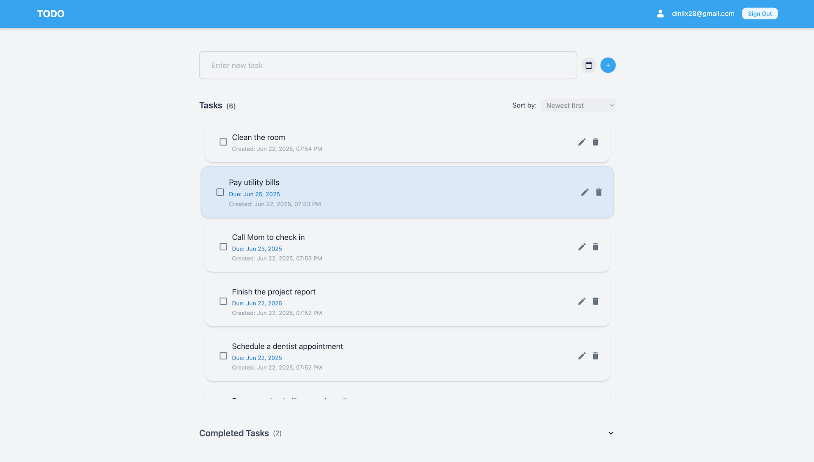

# Todo App

A modern, full-featured Todo application built with React, TypeScript, and Vite, leveraging Firebase for authentication and data storage. Styled with Tailwind CSS for a clean, responsive user experience.

## Features

- **User Authentication**: Secure sign up, log in, and log out with Firebase Auth.
- **Task Management**: Add, edit, complete, and delete tasks. Each task supports a description, status, creation date, and optional due date.
- **Task Editing**: Inline editing of task descriptions with modification tracking.
- **Task Sorting**: Sort tasks by creation date or due date.
- **Completed Tasks Dropdown**: Collapse and expand completed tasks for a cleaner view.
- **Responsive Design**: Works seamlessly on desktop and mobile devices.

## Demo




## Technologies Used

- [React](https://react.dev/)
- [TypeScript](https://www.typescriptlang.org/)
- [Vite](https://vitejs.dev/)
- [Firebase](https://firebase.google.com/)
- [Tailwind CSS](https://tailwindcss.com/)
- [React Icons](https://react-icons.github.io/react-icons/)

## Project Structure

```
/ (root)
├── public/
├── src/
│   ├── components/
│   │   ├── Auth.tsx
│   │   ├── Layout.tsx
│   │   ├── Navbar.tsx
│   │   └── TodoList.tsx
│   ├── firebase/
│   │   ├── config.ts
│   │   ├── hooks.ts
│   │   ├── index.ts
│   │   └── services.ts
│   ├── App.tsx
│   ├── main.tsx
│   └── index.css
├── package.json
├── vite.config.ts
└── README.md
```

### Key Components

- **Auth.tsx**: Handles user authentication (sign up, log in, log out).
- **Layout.tsx**: Provides the main layout, including the navbar and content area.
- **Navbar.tsx**: Displays the app title and user info.
- **TodoList.tsx**: Main logic for displaying, adding, editing, and sorting tasks.

### Firebase Modules

- **config.ts**: Firebase configuration.
- **hooks.ts**: Custom React hooks for authentication and user state.
- **index.ts**: Exports Firebase services and hooks.
- **services.ts**: Initializes Firebase Auth and Firestore.

## Getting Started

### Prerequisites

- [Node.js](https://nodejs.org/)
- [npm](https://www.npmjs.com/) or [yarn](https://yarnpkg.com/)

### Installation

1. **Clone the repository**
   ```sh
   git clone https://github.com/lxnid/todo-app.git
   cd todo-app
   ```
2. **Install dependencies**
   ```sh
   npm install
   # or
   yarn install
   ```
3. **Configure Firebase**
   - Create a Firebase project at [Firebase Console](https://console.firebase.google.com/).
   - Enable Email/Password authentication.
   - Create a `.env` file in the root directory and add your Firebase config variables:
     ```env
     VITE_FIREBASE_API_KEY=your_api_key
     VITE_FIREBASE_AUTH_DOMAIN=your_auth_domain
     VITE_FIREBASE_PROJECT_ID=your_project_id
     VITE_FIREBASE_STORAGE_BUCKET=your_storage_bucket
     VITE_FIREBASE_MESSAGING_SENDER_ID=your_messaging_sender_id
     VITE_FIREBASE_APP_ID=your_app_id
     VITE_FIREBASE_MEASUREMENT_ID=your_measurement_id
     ```
   - Update `src/firebase/config.ts` to use environment variables if needed.

### Running Locally

```sh
npm run dev
# or
yarn dev
```

Visit [http://localhost:5173](http://localhost:5173) to view the app.

### Building for Production

```sh
npm run build
# or
yarn build
```

The production-ready files will be in the `dist` directory.

## License

This project is licensed under the MIT License.

---

*Empower Your Day, One Task at a Time – Stay Organized, Stay Ahead!*